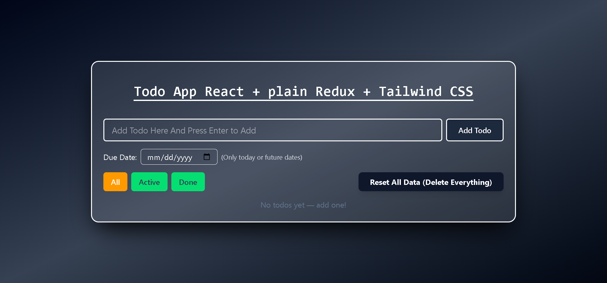
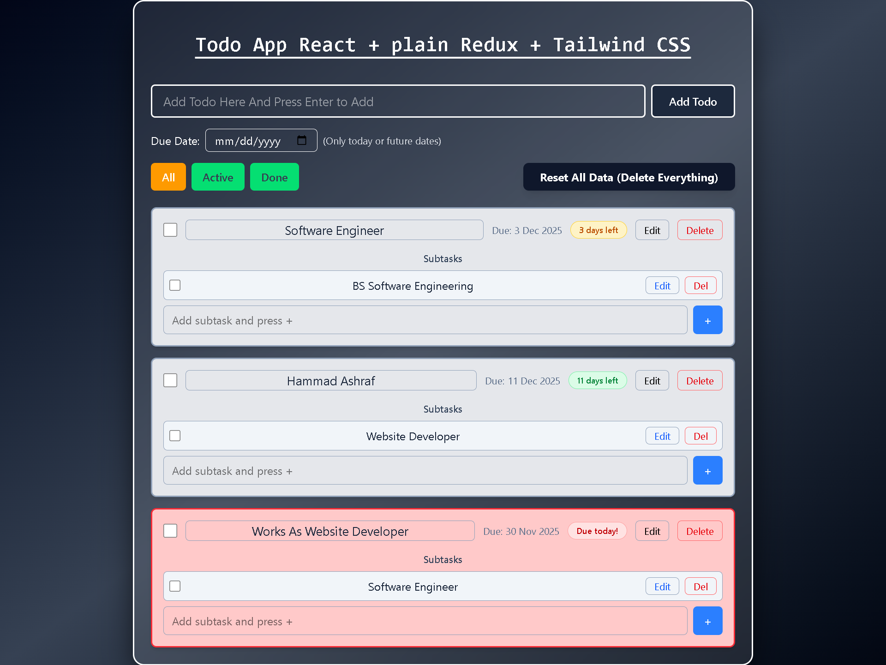

# TodoMaster – Advanced Todo App with Due Dates, Subtasks & Local Persistence

### React Redux Tailwind CSS Local Storage

- A beautiful, fast, and fully-featured Todo App built with React + Plain Redux + Tailwind CSS – no external libraries, no bloat.
- Perfect for learning Redux, state management, and building real-world apps.

## Features

- FeatureStatusAdd, edit, delete todosDoneDue dates (future dates only)DoneSmart countdown ("3 days left", "Due today!", "Overdue!")- DoneSubtasks with full CRUDDoneMark subtasks as completeDoneFilter: All / Active / DoneDone100% data saved in localStorageDoneReset all data with one clickDoneFully responsive & mobile-friendlyDoneBeautiful glassmorphism designDoneZero external dependenciesDone

- Screenshots
- Main View
- Subtasks
- Due Date Countdown
- Mobile View Reset Button

---

## View

---

---

## Tech Stack

- React 18 (Functional Components + Hooks)
- Plain Redux (No Redux Toolkit – great for learning!)
- Tailwind CSS (Utility-first styling)
- LocalStorage (Full persistence)
- Vite (Fast dev server)

### Why This Project is Special

- This is not just another todo app.
- It's a complete learning resource and a portfolio masterpiece because:

- Clean, readable code with perfect separation of concerns
- Real-world features (due dates, subtasks, countdowns)
- Full local persistence (data survives browser close)
- No magic – you can understand every line
- Beautiful UI that stands out in job interviews

### Perfect for:

- Learning Redux from scratch
- Portfolio projects
- Open source contributions
- Interview preparation

---

## Project Structure

textsrc/
├── components/
│ ├── TodoInput.jsx → Add todos + due dates + subtasks
│ ├── TodoItem.jsx → Full todo with subtasks & countdown
│ ├── TodoList.jsx
│ ├── FilterButton.jsx
│ └── ClearAllButton.jsx → Reset all data
├── store/
│ ├── actions/
│ ├── reducers/
│ └── store.js → With localStorage sync!
├── App.jsx
└── main.jsx
Local Storage Persistence
Your todos are automatically saved to localStorage every time you:

- Add/edit/delete a todo
- Toggle completion
- Change filter

- Close the browser → come back → everything is still there!
- Reset All Data
- Click the "Reset All Data" button to clear everything and start fresh.

### Made With Love By

- Engr.Hammad Ashraf
- Frontend Developer | React & Redux Enthusiast
